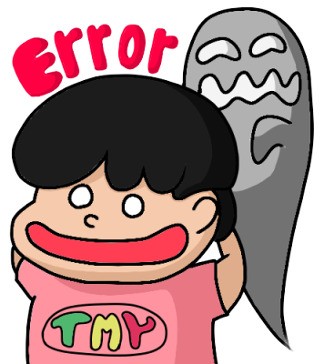

<h1 align="center">Hi 👋, I'm Nguyeenx Tieens Myx</h1>
<h3 align="center">3rd year IT student</h3>

  

<table>
  <tr>
    <td>
      <h4>A little more about me</h4>
      <ul>
        <li>🔭 Study and work in <strong>Da Nang</strong></li>
        <li>🌱 I’m currently learning ReactJS & NodeJS & Japanese</li>
        <li>💬 1st year college personal project: <a href="https://github.com/tienmynguyen/obookpromax.git">Obooks</a></li>
        <li>💬 2nd year college personal project: <a href="https://github.com/tienmynguyen/HiveHub.git">HiveHub</a></li>
        <li>👨‍💻 Life Hack: Use Spiritual Power to Code 🔮🪄</li>
        <li>⚡ Fun fact: I waste most of my time thinking about my ex</li>
        <li>📫 How to reach me: <a href="mailto:mytom2401@gmail.com">mytom2401@gmail.com</a></li>
      </ul>
    </td>
    <td>
      
    </td>
  </tr>
</table>
## 🛠️ Technologies and Tools I use:

 
<h3>Connect with me:<a href="https://www.facebook.com/profile.php?id=100059974770043">Nguyễn Tiến Mỹ</a></h3>

  

